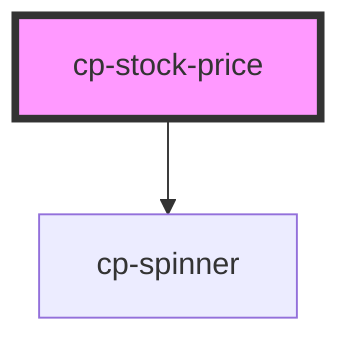

# cp-stock-price

<!-- Auto Generated Below -->

## Properties

| Property         | Attribute          | Description | Type     | Default     |
| ---------------- | ------------------ | ----------- | -------- | ----------- |
| `stockUserInput` | `stock-user-input` |             | `string` | `undefined` |

## Dependencies

### Depends on

- [cp-spinner](../cp-spinner)

### Graph

----------------------------------------------

*Built with [StencilJS](https://stenciljs.com/)*
